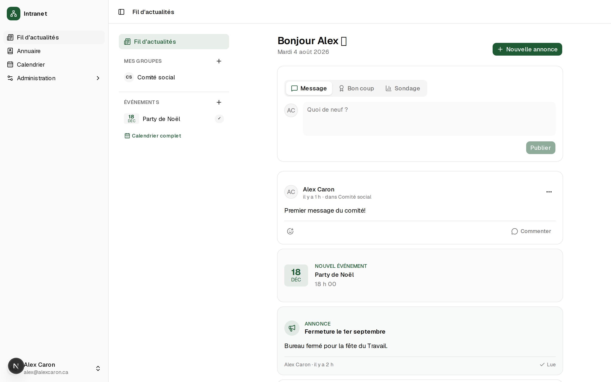
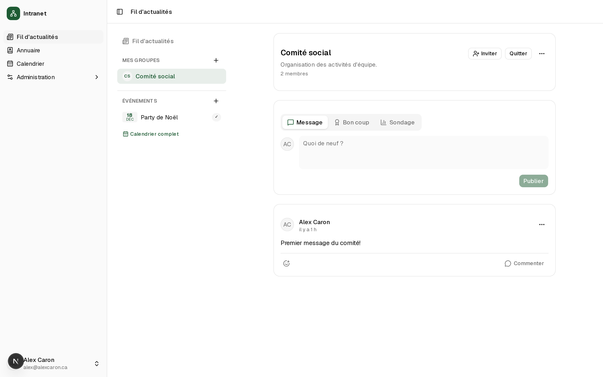
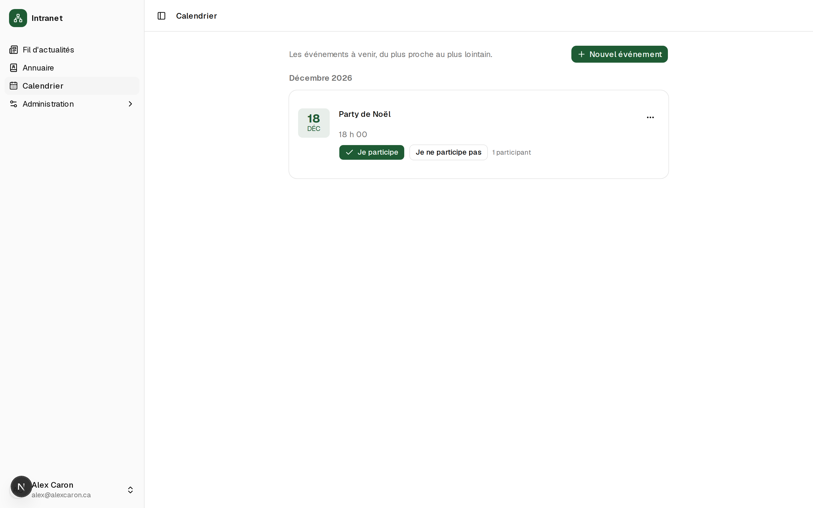
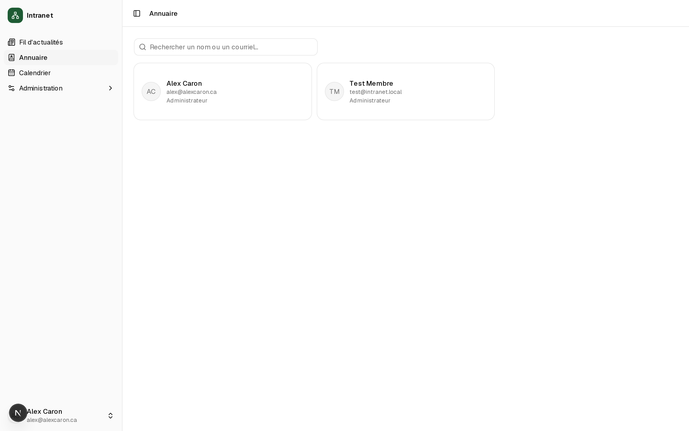
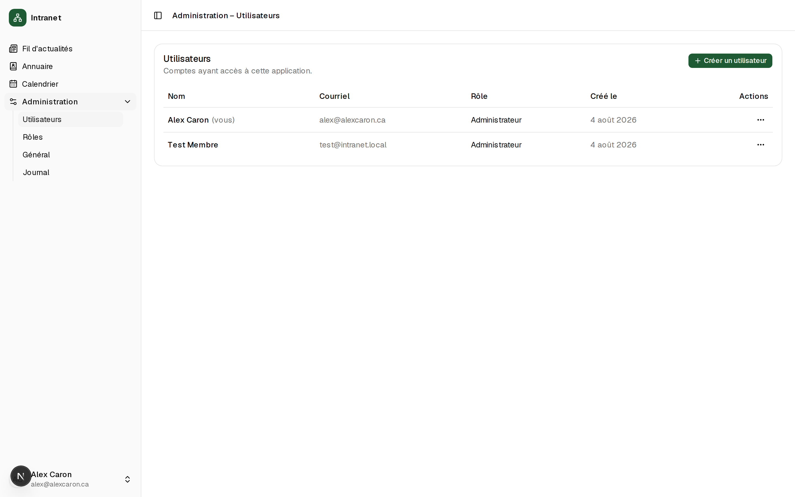

# Intranet

Réseau social interne pour PME : un fil d'actualités unique où vivent les publications des employés, les annonces officielles, les événements et les groupes — pensé pour remplacer le groupe Facebook privé et les courriels « à tout le monde ».

Construit à partir de mon [admin-template](https://github.com/alexcarrrrdev/admin-template) (authentification, rôles et permissions dynamiques, journal d'audit, identité personnalisable).

## Aperçu


*Le fil d'actualités, page d'accueil : composeur (message, bon coup, sondage), annonces et événements intégrés au fil, rail de navigation par groupe et par événement*

| | |
| :---: | :---: |
|  |  |
| *Un groupe privé et son fil réservé aux membres* | *Calendrier des événements avec participation* |
|  |  |
| *Annuaire des employés* | *Gestion des utilisateurs, rôles et permissions* |


*Connexion — nom, logo et couleur personnalisables, sans inscription publique*

## Modules

- **Fil d'actualités** (`/fil`) — le hub de l'intranet. Trois types de publications : **messages**, **bons coups** (féliciter un collègue, mis en valeur dans le fil) et **sondages** (2 à 5 choix, un vote par personne, résultats en barres). Réactions emoji, commentaires, suppression par l'auteur ou un modérateur (`post:delete-any`).
- **Annonces** — canal officiel direction → employés, directement dans le fil. Bouton « Marquer comme lue » et compteur **« Lue par X/Y »** avec la liste des lecteurs pour les gestionnaires (`announcement:manage`) — ce qu'un groupe Facebook ne fera jamais. Annonces épinglées toujours en tête de fil.
- **Groupes privés sur invitation** — chaque groupe a son fil, lisible par ses membres seulement. Pas d'adhésion libre : un membre vous invite, vous acceptez ou refusez (section « Invitations » dans le rail). Un clic sur un groupe filtre le fil.
- **Événements** (`/calendrier` + rail du fil) — liste des événements à venir, participation **« Je participe / Je ne participe pas »** avec compteur, et chaque événement a ses propres publications dans le fil.
- **Annuaire** (`/annuaire`) — tous les employés actifs avec photo, rôle et courriel, recherche instantanée.
- **Photo de profil** — chaque employé téléverse la sienne (10 Mo max, validation par signature binaire), reprise partout dans l'app.

Le tout hérite du socle du template : **rôles et permissions dynamiques** (la navigation et chaque action s'adaptent aux permissions), **journal d'audit** des actions de gestion, **identité personnalisable** (nom, logo, couleur — vert sapin par défaut), thème clair/sombre, et une sécurité vérifiée en profondeur (chaque Server Action revérifie session et permission ; un utilisateur ne voit que ce qu'il a le droit de voir).

## Technologies

- **[Next.js](https://nextjs.org)** (App Router) — frontend et backend (Server Actions) dans une seule application à déployer.
- **[TypeScript](https://www.typescriptlang.org)**, **[React](https://react.dev)**, **[Tailwind CSS](https://tailwindcss.com)** v4.
- **[PostgreSQL](https://www.postgresql.org)** via Docker, **[Drizzle ORM](https://orm.drizzle.team)** (schéma TypeScript, migrations SQL générées).
- **[Better Auth](https://www.better-auth.com)** — sessions, réinitialisation de mot de passe, rate limiting persistant.
- **Vitest** — tests unitaires, composants et intégration contre une vraie base Postgres.

## Démarrer

```bash
cp .env.example .env        # générer BETTER_AUTH_SECRET avec : openssl rand -base64 32
docker compose up -d        # PostgreSQL local
npm install
npm run db:migrate
npm run create-admin -- --name "Prénom Nom" --email vous@exemple.com --password "MotDePasse123!"
npm run dev
```

L'application tourne sur [http://localhost:3000](http://localhost:3000). Il n'y a **pas d'inscription publique** : le premier compte est créé par le script ci-dessus, les suivants depuis `/administration/utilisateurs`.

Commandes utiles : `npm run db:generate` (nouvelle migration après modification de `src/db/schema.ts`), `npm run db:studio` (explorer les données), `npx vitest run` (tests), `npm run lint`.

## Courriels

Aucun fournisseur n'est branché par défaut : en développement, les courriels (réinitialisation de mot de passe) s'affichent dans la console du serveur. Pour la production, modifier `sendEmail` dans `src/lib/email.ts` (Resend, SMTP…) — rien d'autre à changer.
