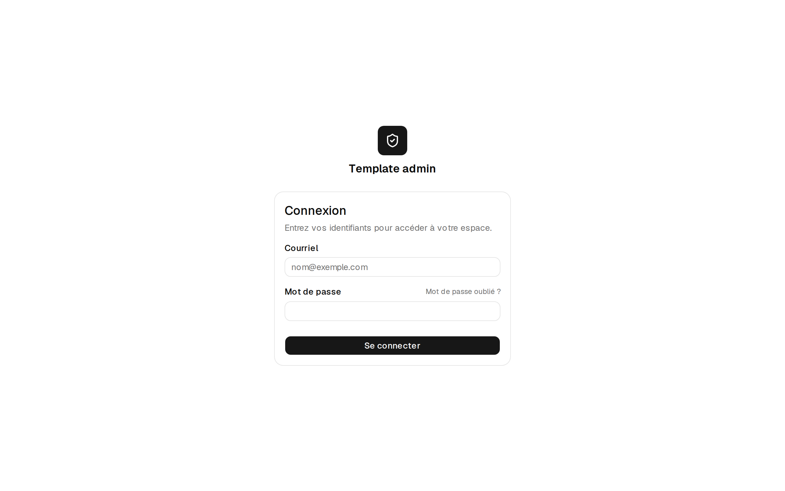
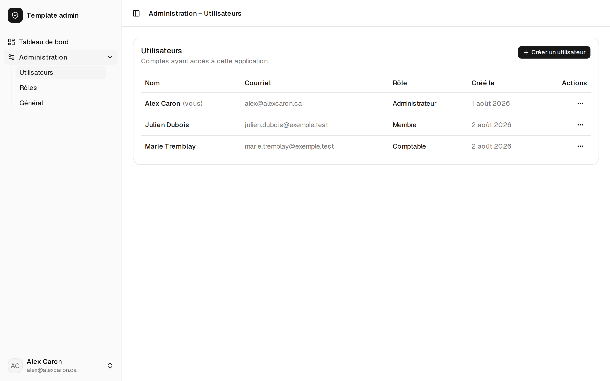
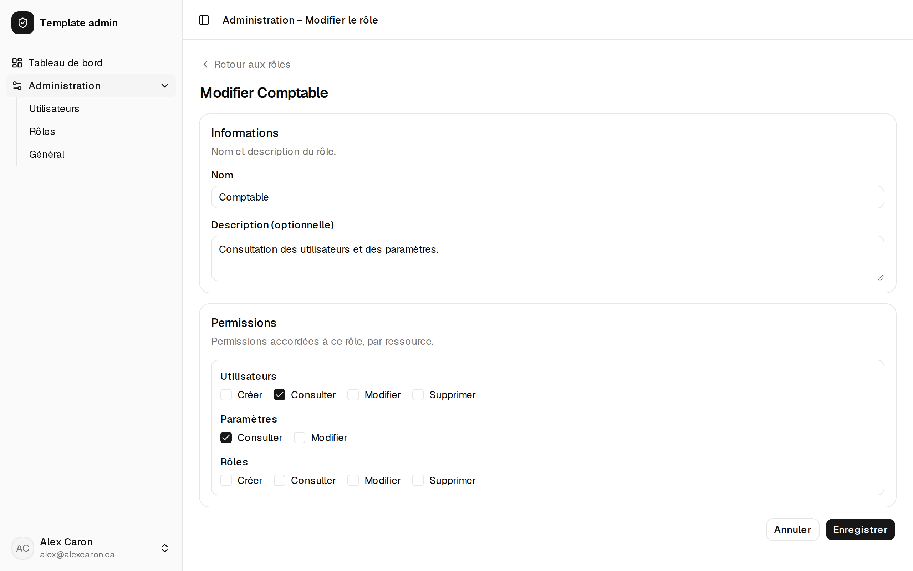
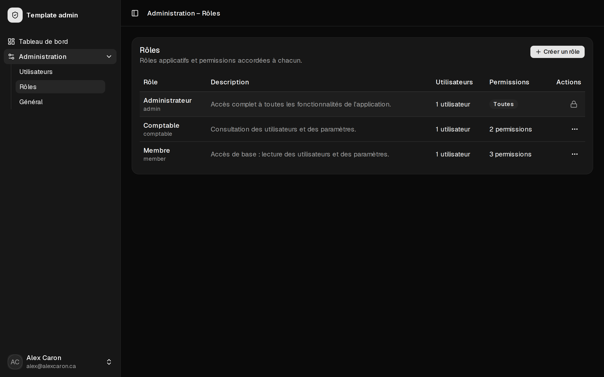
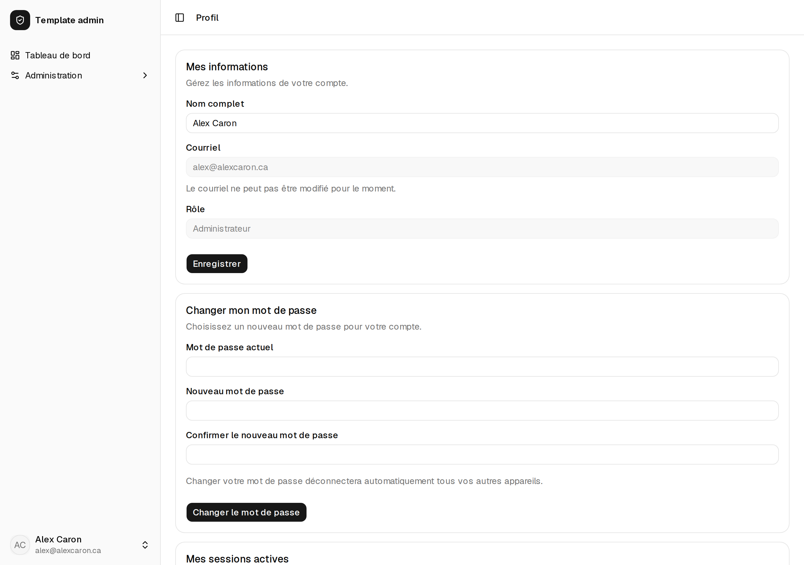

# Admin Template

Projet personnel qui me sert de base commune pour tous les systèmes de gestion (admin / back-office) que je développe pour mes clients.

Plutôt que de repartir de zéro à chaque projet client, ce template regroupe la structure et les fonctionnalités de départ que je réutilise d'un système de gestion à l'autre.

## Aperçu

| | |
| :---: | :---: |
|  |  |
| *Connexion (nom et logo personnalisables)* | *Gestion des utilisateurs* |
|  |  |
| *Rôles : matrice de permissions par ressource* | *Mode sombre* |


*Profil : informations, changement de mot de passe et sessions actives*

## Fonctionnalités

- **Authentification complète** (Better Auth) : connexion, sessions, réinitialisation de mot de passe par courriel — sans inscription publique, les comptes étant créés par un administrateur.
- **Rôles et permissions dynamiques** : rôles créés depuis l'interface avec une matrice de permissions par ressource ; la navigation et les actions s'adaptent automatiquement aux permissions de chacun.
- **Gestion des utilisateurs** : création, modification et suppression douce (données conservées, déconnexion immédiate) depuis la section Administration.
- **Journal d'audit** : historique consultable (`/administration/journal`) des actions administratives — qui a fait quoi, quand, sur quoi.
- **Profil** : informations du compte, changement de mot de passe (qui déconnecte les autres appareils) et liste des sessions actives avec révocation.
- **Identité par client** : nom de l'application, logo et couleur principale configurables depuis l'interface, affichés jusque sur la page de connexion — dupliquer le template, c'est surtout changer ces champs. Pour la couleur, le contraste du texte et une variante adaptée au mode sombre sont calculés automatiquement à partir de la seule teinte choisie, avec une réinitialisation en un clic vers le thème par défaut.
- **Thème clair / sombre / système**, sans clignotement au chargement.
- **Sécurité par défaut** : en-têtes HTTP (CSP, HSTS…), limitation de débit persistante sur la connexion, validation des variables d'environnement au démarrage, garde-fous anti-verrouillage (dernier administrateur protégé, rôle admin immuable).
- **Tests** : unitaires, composants et intégration contre une vraie base Postgres.

## Technologies utilisées

- **[Next.js](https://nextjs.org)** (App Router) — framework React full-stack : le frontend et le backend (Server Actions, Route Handlers) vivent dans le même projet, ce qui donne une seule application à déployer par client.
- **[React](https://react.dev)** — bibliothèque UI.
- **[TypeScript](https://www.typescriptlang.org)** — typage statique de bout en bout, pour adapter le template d'un client à l'autre sans casser des choses silencieusement.
- **[Tailwind CSS](https://tailwindcss.com)** (v4) — styling utilitaire, facile à personnaliser aux couleurs de chaque client.
- **[PostgreSQL](https://www.postgresql.org)** — base de données relationnelle, lancée localement via Docker.
- **[Drizzle ORM](https://orm.drizzle.team)** — ORM TypeScript léger : schéma défini en TypeScript, migrations SQL lisibles et générées automatiquement, sans surcouche superflue.
- **[Better Auth](https://www.better-auth.com)** — authentification par courriel/mot de passe (connexion, réinitialisation de mot de passe) et permissions par rôle, branchée directement sur la base Postgres via l'adaptateur Drizzle.
- **ESLint** — linting avec la configuration Next.js.
- **Turbopack** — bundler utilisé par `next dev` et `next build`.

## Démarrer

```bash
npm install
npm run dev
```

L'application tourne ensuite sur [http://localhost:3000](http://localhost:3000).

## Base de données

1. Copier `.env.example` vers `.env` (les valeurs par défaut fonctionnent avec le `docker-compose.yml` fourni ; si un autre Postgres occupe déjà le port 5432 sur la machine, changer `POSTGRES_PORT` et le port dans `DATABASE_URL`) :

   ```bash
   cp .env.example .env
   ```

2. Démarrer PostgreSQL en local avec Docker :

   ```bash
   docker compose up -d
   ```

3. Appliquer les migrations :

   ```bash
   npm run db:migrate
   ```

Autres commandes utiles : `npm run db:generate` pour générer une nouvelle migration après une modification de `src/db/schema.ts`, et `npm run db:studio` pour ouvrir Drizzle Studio et explorer les données.

## Authentification

L'authentification (connexion, sessions, réinitialisation de mot de passe) est gérée par Better Auth. Il n'y a **pas d'inscription publique** : les comptes sont créés uniquement par un administrateur.

### Variables d'environnement

En plus de `DATABASE_URL`, deux variables sont nécessaires (voir `.env.example`) :

- `BETTER_AUTH_SECRET` — clé secrète servant à signer/chiffrer les sessions, d'au moins 32 caractères. Générer une valeur unique par environnement avec `openssl rand -base64 32`.
- `BETTER_AUTH_URL` — URL de base de l'application (ex. `http://localhost:3000` en local).

Ces trois variables (avec `DATABASE_URL`) sont validées une seule fois, au démarrage, par `src/lib/env.ts` : si l'une d'elles est absente ou mal formée (ex. secret trop court, URL invalide), l'application refuse de démarrer et affiche un message d'erreur explicite listant chaque variable en cause, plutôt que d'échouer plus tard de façon confuse.

### Limitation de débit (rate limiting)

Les tentatives de connexion et de réinitialisation de mot de passe sont limitées par IP, en production uniquement, avec des compteurs stockés en base (table `rate_limit`, survit aux redémarrages). Deux mécanismes appliquent cette même politique, car ils couvrent deux chemins d'accès distincts : le rate limiting intégré de Better Auth (`rateLimit` dans `src/lib/auth/index.ts`) protège les requêtes qui passent par son routeur HTTP, tandis que `src/lib/auth/rate-limit.ts` protège les Server Actions (`src/app/actions/auth.ts`), qui appellent l'API de Better Auth directement et contourneraient sinon entièrement cette protection.

### Créer le premier compte administrateur

```bash
npm run create-admin -- --name "Alex Caron" --email alex@exemple.com --password "MotDePasse123!"
```

Sans arguments, le script les demande un à un de façon interactive. Il crée l'utilisateur avec le rôle `admin` (voir « Gestion des utilisateurs et des rôles » ci-dessous, et `src/lib/auth/permissions.ts` pour le détail du catalogue de permissions) en utilisant directement les fonctions internes de Better Auth, afin que le mot de passe soit haché exactement comme pour une connexion normale.

### Gestion des utilisateurs et des rôles

Un administrateur gère les comptes et les rôles applicatifs depuis **/administration/utilisateurs** et **/administration/roles** : création, modification, suppression, et une matrice de permissions par ressource (voir le catalogue `statement` dans `src/lib/auth/permissions.ts`) pour les rôles personnalisés. Chaque action de ces pages (bouton « Créer », « Modifier », « Supprimer ») ne s'affiche que si l'utilisateur connecté a la permission correspondante — un simple confort d'UI, la vérification qui fait autorité reste dans les Server Actions (`src/app/actions/users.ts`, `src/app/actions/roles.ts`).

- **Rôles système** : `admin` (accès complet à toutes les ressources, y compris celles ajoutées plus tard dans le code — aucune ligne dans `role_permission` pour lui) et `member`, le rôle par défaut de tout nouveau compte. **`member` démarre sans aucune permission** : un administrateur doit les accorder explicitement depuis /administration/roles. (Les bases de données déjà en production dont le rôle `member` avait été personnalisé ne perdent, lors de la mise à jour, que les deux permissions par défaut historiques du template — `user:read` et `settings:read` — le reste des permissions accordées est conservé ; voir la migration `drizzle/0006_soft_delete_users.sql`.)
- **Suppression d'un utilisateur** : c'est une suppression douce (*soft delete*), pas un effacement — la rangée `user` est conservée (colonne `deleted_at`), seulement marquée comme supprimée. Ses sessions actives sont révoquées immédiatement (l'utilisateur est déconnecté dès sa prochaine requête) et toute nouvelle tentative de connexion échoue avec le même message générique qu'un mauvais mot de passe, y compris via un appel direct à `/api/auth/sign-in/email` (voir le hook `databaseHooks.session.create.before` dans `src/lib/auth/index.ts`, qui bloque la création de session au niveau de Better Auth lui-même, pas seulement dans l'interface). Le courriel du compte supprimé reste réservé (il ne peut pas servir à créer un nouveau compte). Il n'y a pas d'interface de restauration pour l'instant : réactiver un compte est une opération manuelle en base de données (remettre `deleted_at` à `NULL`).

### Envoi de courriels (réinitialisation de mot de passe)

Aucun fournisseur de courriel n'est installé par défaut. Tant qu'aucun n'est configuré, `src/lib/email.ts` affiche simplement le message (destinataire, sujet, lien de réinitialisation) dans la console du serveur — pratique en développement, sans dépendance externe ni clé API.

Pour brancher un vrai fournisseur (ex. [Resend](https://resend.com), SMTP...) en production, il suffit de modifier la fonction `sendEmail` dans `src/lib/email.ts` : le reste de l'application (flux de réinitialisation de mot de passe, etc.) n'a rien à changer.

### Logo personnalisé

Un administrateur peut téléverser un logo depuis **/administration/general** (carte « Logo »), en plus du nom de l'application déjà personnalisable sur cette même page. Le logo remplace l'icône par défaut (ShieldCheck) partout où l'identité de l'application est affichée : barre latérale et pages publiques de connexion (`/`, `/mot-de-passe-oublie`, `/reinitialiser-mot-de-passe`).

- **Formats acceptés** : PNG, JPEG, WebP et SVG.
- **Taille maximale** : 1 Mo.
- **Repli par défaut** : tant qu'aucun logo n'est téléversé (ou après un clic sur « Retirer le logo »), l'icône ShieldCheck s'affiche à sa place — aucune configuration n'est requise pour démarrer.

Le fichier est validé côté serveur (taille, type MIME, signature binaire pour PNG/JPEG/WebP, liste noire de motifs dangereux pour SVG — voir `src/lib/settings/logo-validation.ts`) puis stocké directement en base de données (colonnes `logo`/`logo_mime_type` de `app_settings`, voir `src/db/schema.ts`), sans dépendance à un stockage de fichiers externe. Il est ensuite servi par la route `/logo` (`src/app/logo/route.ts`), publique et mise en cache de façon agressive côté navigateur grâce à un paramètre de version qui change automatiquement à chaque mise à jour.

### Journal d'audit

Un administrateur (permission `audit:read`, accordée automatiquement au rôle `admin`) consulte depuis **/administration/journal** l'historique des actions administratives : qui (acteur), quoi (action, avec un court diff avant/après quand pertinent), sur quoi (cible) et quand — avec filtres (par action, par acteur) et pagination. Voir `src/lib/audit/audit.ts` pour le catalogue complet des actions journalisées et `src/db/schema.ts` (table `audit_log`) pour le détail des colonnes.

- **Journalisé** : création/modification/suppression d'un utilisateur, création/modification/suppression d'un rôle, changement du nom de l'application, du logo ou de la couleur principale, connexion, changement ou réinitialisation de mot de passe, modification du nom depuis /profil, révocation d'une session ou de toutes les autres.
- **Volontairement PAS journalisé** :
  - les **tentatives de connexion échouées** — les journaliser exposerait le journal lui-même à être inondé par un tiers qui essaierait des mots de passe au hasard sur un compte connu (la limitation de débit sur `/sign-in/email` réduit ce risque sans l'éliminer : elle limite par IP, pas par compte visé) ;
  - les **demandes de réinitialisation de mot de passe** — même risque d'inondation, plus un risque propre au journal : cette action répond volontairement de la même façon qu'un courriel corresponde ou non à un compte existant (anti-énumération de comptes), la journaliser recréerait cette fuite dans le journal lui-même.
- **Conservation** : illimitée pour l'instant — aucune purge automatique. Si le volume devient un problème, une purge manuelle (`DELETE FROM audit_log WHERE created_at < ...`) reste possible directement en base, la table n'ayant aucune contrainte de clé étrangère entrante.
- **Écriture seule** : le module (`src/lib/audit/audit.ts`) n'expose aucune fonction de mise à jour ni de suppression — une trace d'audit ne se corrige pas après coup.

## Tests

Les tests utilisent [Vitest](https://vitest.dev), avec deux « projects » configurés dans `vitest.config.mts` :

- **`node`** — tests unitaires backend purs, sans base de données : `src/lib/auth/permissions.ts` (permissions par rôle), `src/lib/auth/schemas.ts` (validation Zod) et `src/lib/email.ts`.
- **`jsdom`** — tests de composants React (DOM simulé, [Testing Library](https://testing-library.com)) : les initiales dans `src/components/nav-user.tsx` et les formulaires d'authentification (`login-form.tsx`, `forgot-password-form.tsx`, `reset-password-form.tsx`). Les Server Actions (`src/app/actions/auth.ts`) y sont simulées avec `vi.mock`, aucun de ces tests ne touche à la base de données.

Un troisième project, **`integration`**, teste `src/lib/auth/index.ts` contre une vraie base Postgres locale (via `auth.api.signInEmail`, `signUpEmail`, etc., pas par HTTP) : création d'utilisateur, connexion, rejet de l'inscription publique, réinitialisation de mot de passe. Ces tests vivent dans des fichiers `*.integration.test.ts` et nécessitent Postgres démarré (`docker compose up -d`).

```bash
npm test                 # tout : node, jsdom et integration (Postgres requis)
npm run test:unit        # seulement node et jsdom, sans base de données
npm run test:integration # seulement les tests d'intégration
npm run test:watch       # mode watch, sans les tests d'intégration
```

Si Postgres n'est pas démarré, seuls les tests d'intégration échouent — les tests unitaires et de composants continuent de s'exécuter normalement, et le message d'erreur rappelle comment démarrer la base ou lancer `npm run test:unit`.

Chaque test d'intégration crée son propre utilisateur avec un courriel unique et le supprime après coup (`afterEach`) : la suite est rejouable sans risque et ne touche jamais aux comptes existants.

Les tests vivent à côté du code qu'ils couvrent (`src/**/*.test.ts(x)`), ce qui rend le pattern facile à reproduire pour tout nouveau fichier du template. Il n'y a pas de tests end-to-end (Playwright) dans ce template.
